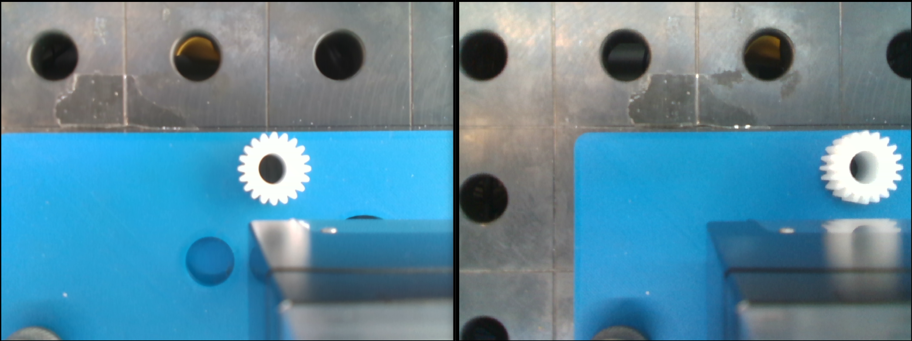
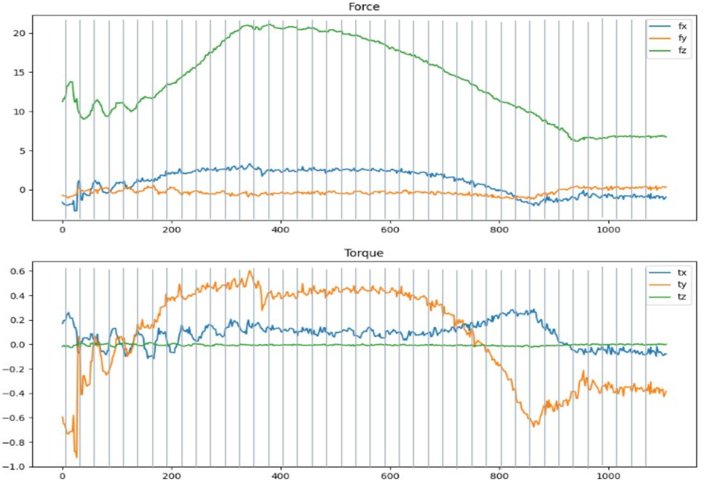
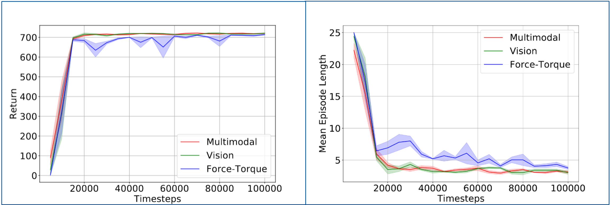
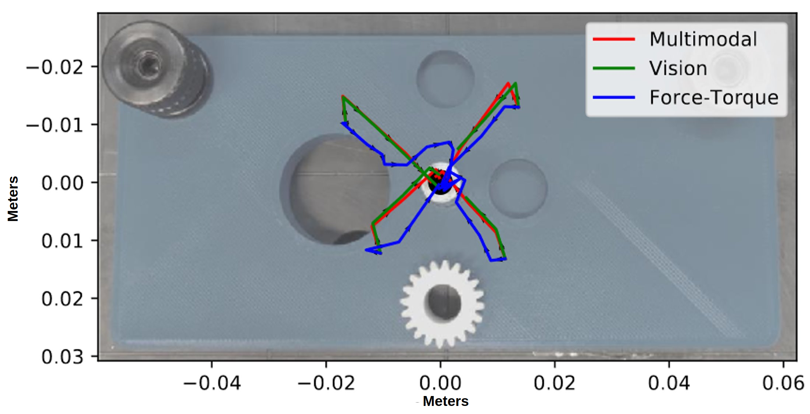
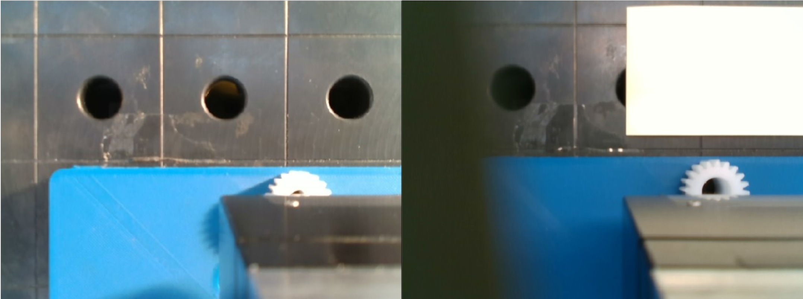
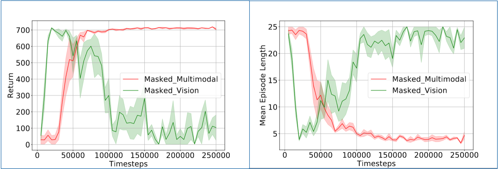
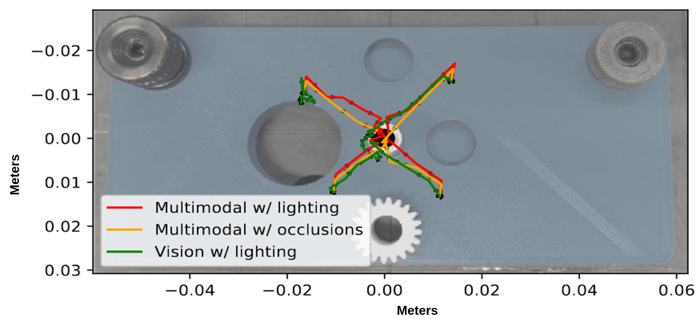

# MultimodalRL_MasterThesis
Combining Visual Servoing and Force Control with Reinforcement Learning for Gear Assembly

## Abstract:
The deployment of robots has been steadily growing worldwide, but their use in assembly tasks remains limited compared to other application areas. The high sensitivity to tolerances required for assembly-related tasks is a significant factor impeding this growth. To implement robustness in these robots, numerous researchers leverage learning-based systems equipped with sensors, such as cameras and force-torque sensors. Relying solely on individual sensors can limit adaptability and robustness, leading to the need for multimodal fusion-based approaches that use different sensor modalities. Nevertheless, implementing such a system in operational scenarios involves obtaining datasets, training, and deploying the learning-based system. This creates a significant barrier to wide-scale adoption due to the shortage of skilled personnel capable of performing these tasks. So, to deal with this restriction, we present an alternative pipeline to train and deploy an RL model using a mini-simulation setup built from actual sensor observations. This system can be used by technicians operating robotic manipulators as it streamlines the drift calibration process by minimizing technician effort and reducing machine downtime to enable quick deployment.

## Description
The system developed in this thesis focused on using real sensor data: vision and force-torque readings obtained from the sensors fixed on the end-effector of a UR5e manipulator robot to create a lightweight simulation model to train a multimodal Reinforcement Learning policy(Soft Actor Critic) and deploy on the robot cell.

Sample input images used for the policy are shown below:

### Sensor Data
We used a vision sensor: Intel Realsense D435 and a Force-Torque sensor: Weiss KMS40 for this project.
#### Vision Input samples
Observation based on the camera fit on the end-effector

#### Force-Torque Input sample recording
1-second recording containing about 500 values for each force and torque axis.

### Processing
We used a vision autoencoder to extract important features as feature vector from image inputs and a average value for the force-torque input.

### Training and Evaluation
We created 3 different versions to evaluate sensor modality contributions: Vision gridworld, Force-Torque gridworld and Multimodal gridworld.  

#### Optimal environment: Visual observations with ideal lighting and no disturbances
In grid world, the model evaluation performance shown below:

Upon real world deployment, the model uses visual and kinesthetic data to observe the environment and predict the next location of the end-effector holding the gear.

Performance of model on real world robot starting from 4 random misalignment locations:

#### Environment with disturbances: Visual observations contain lighting variations and random occlusions

Distubances in frame:

In grid world, vision and multimodal systems are trained and evaluated, performance shown below:

Performance of model on real world robot starting from 4 random misalignment locations:

## Video
This video shows the performance of the model on real robot. The run contains 100 random locations around the goal location for gear insertion out of which 2 are shown here. The gear inserts successfully upon registering a z-axis drop as can be seen in the video.

